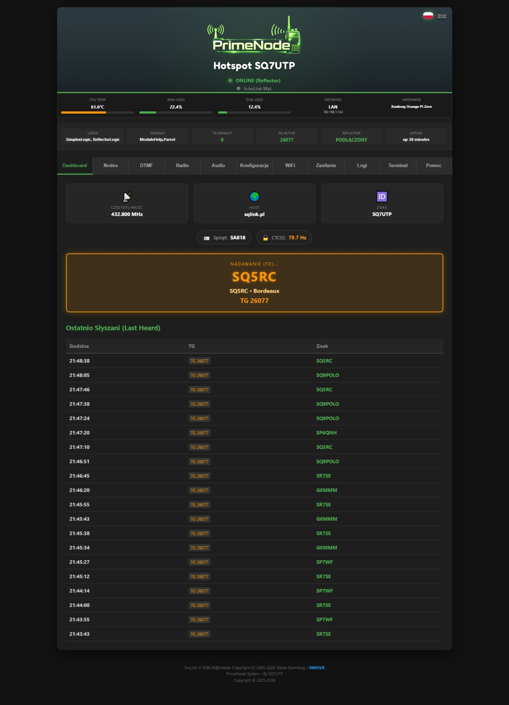
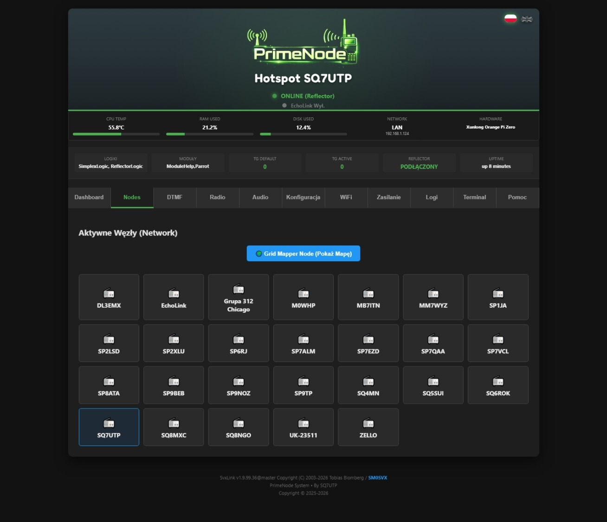
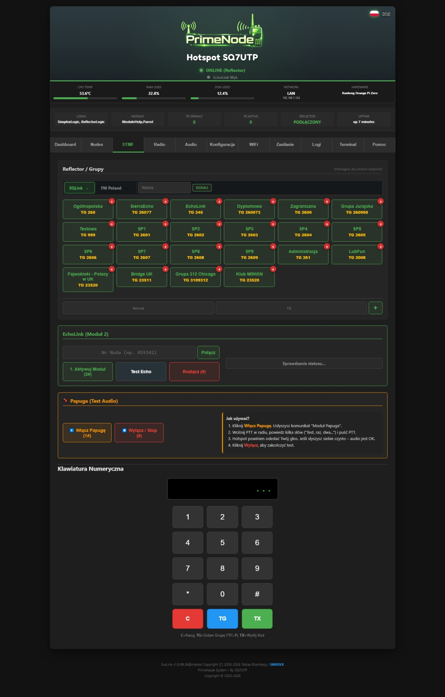
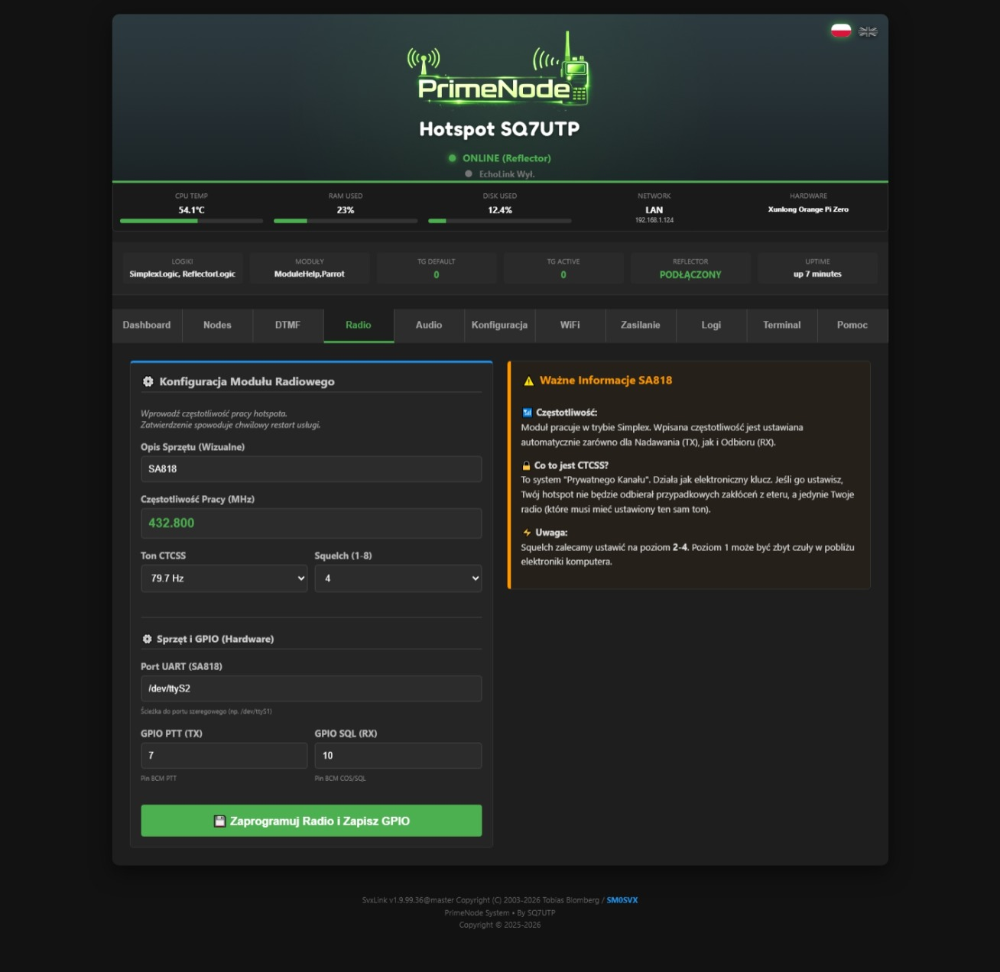
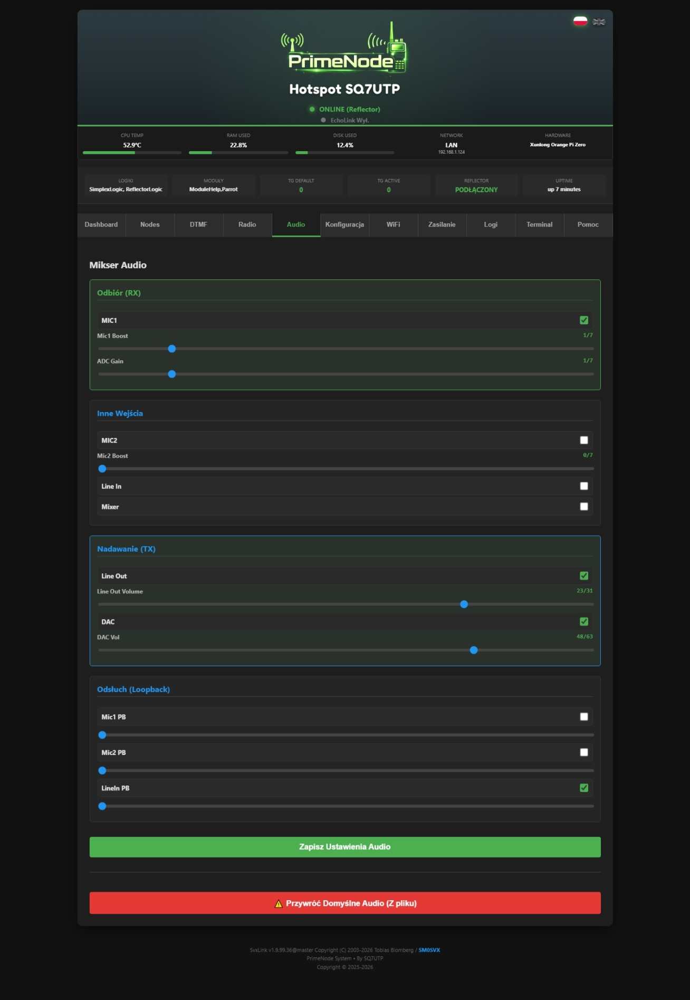
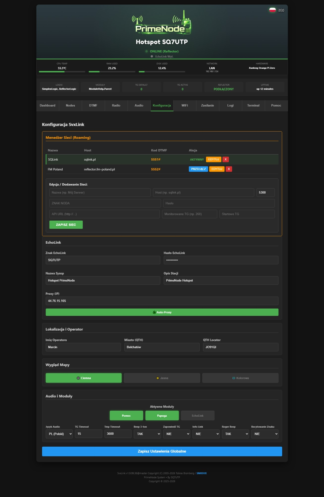
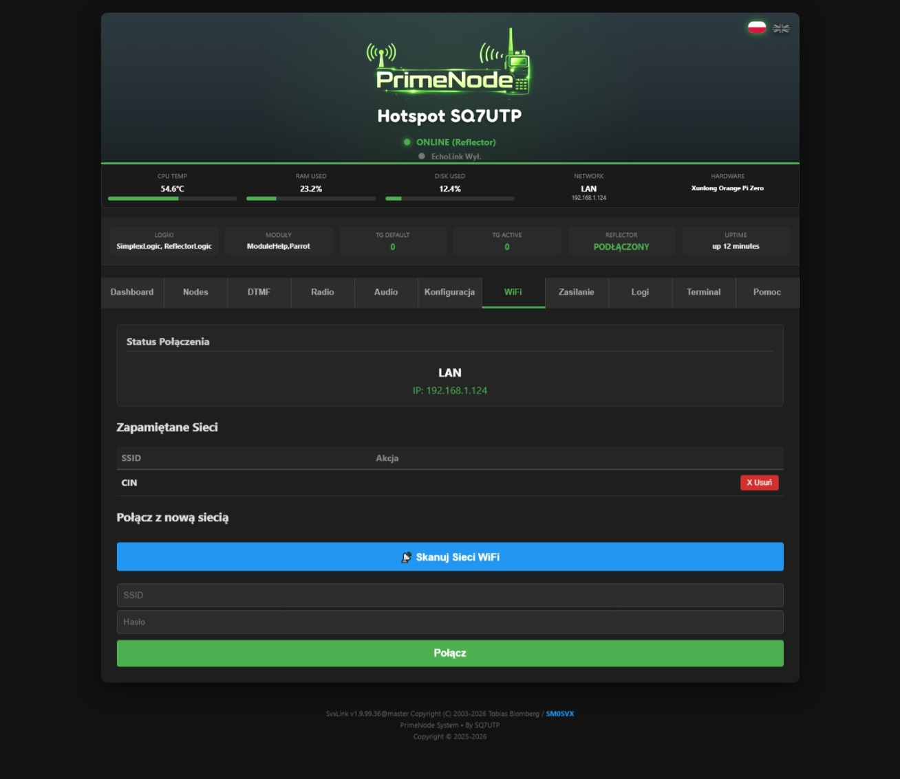
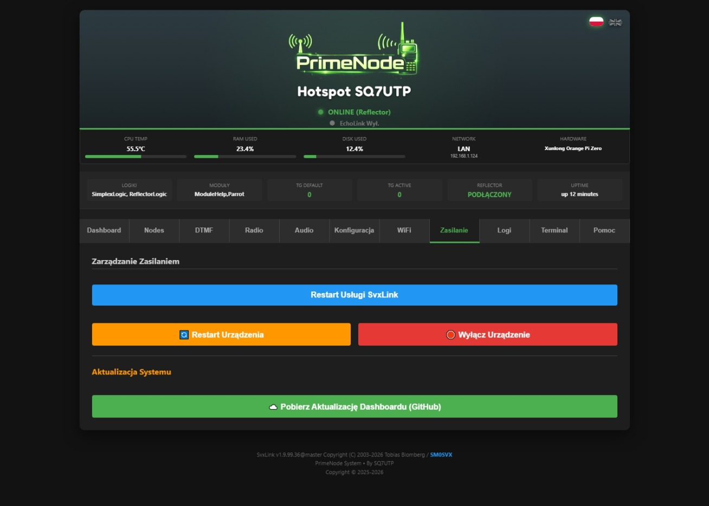
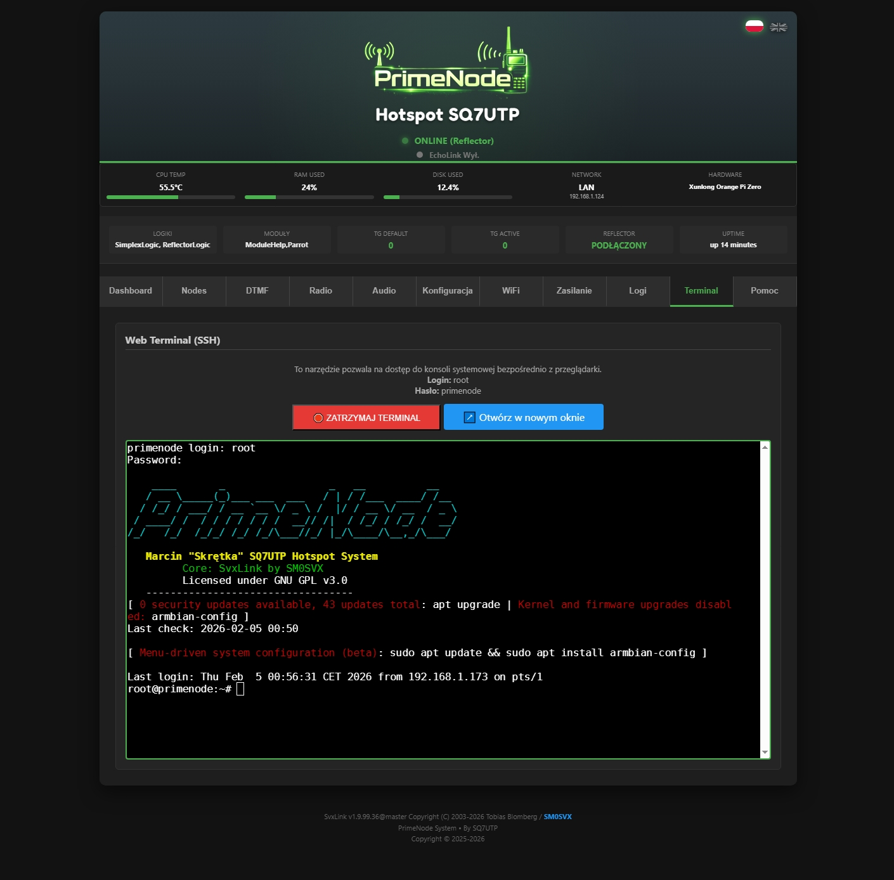
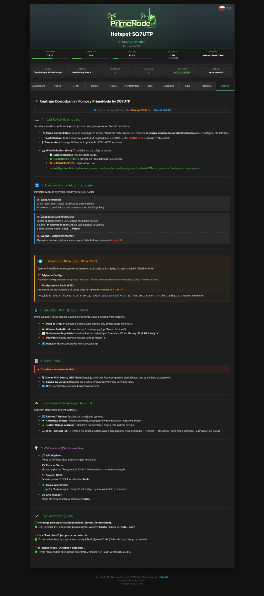

# PrimeNode - OPI0 V1 Hotspot System
### Powered by SvxLink | Developed by SQ7UTP

Witamy w oficjalnym repozytorium systemu **PrimeNode**.
Jest to zaawansowane, lekkie i nowoczesne oprogramowanie dla hotspotów radiowych, oparte na systemie **Armbian** oraz silniku **SvxLink**. Projekt został stworzony od podstaw z myślą o intuicyjnej obsłudze (Dashboard WWW), stabilności (System plików Read-Only/Logi w RAM) oraz elastyczności konfiguracji (Roaming Sieciowy).

> **⚠️ PROJEKT EKSPERYMENTALNY / EXPERIMENTAL PROJECT**
> Oprogramowanie jest dostarczane "takie jakie jest", na licencji GPLv3. Używasz go na własną odpowiedzialność.
> Software is provided "AS IS". Use at your own risk.

---

## 📥 GŁÓWNY OBRAZ SYSTEMU / MAIN SYSTEM IMAGE

Gotowy do wgrania obraz systemu (`.img`) znajduje się w sekcji **Releases** po prawej stronie tego repozytorium. Nie musisz kompilować kodu ręcznie – pobierz, wgraj i używaj.

👉 **[PRZEJDŹ DO POBIERANIA / GO TO RELEASES](../../releases)**

### 🛠️ Kompatybilność Sprzętowa / Hardware
* **Komputer:** Orange Pi Zero (LTS / v1.5)
* **Radio:** Moduł SA818 (Hat SP0DZ lub kompatybilny)
* **Pamięć:** Karta microSD min. 8GB (Zalecane Class 10)

---

## 🚀 Szybki Start / Quick Start

### 🔐 Dane Logowania / Credentials

| Usługa / Service | Login / User | Hasło / Password | Port / Address |
| :--- | :--- | :--- | :--- |
| **Terminal (SSH)** | `root` | `primenode` | 22 |
| **Dashboard WWW** | *(brak / none)* | *(brak / none)* | `http://primenode.local` lub adres IP (LAN IP) |
| **Web Terminal** | `root` | `primenode` | (via Dashboard) |

*(Uwaga: Zalecamy zmianę domyślnego hasła `root` po pierwszym zalogowaniu komendą `passwd`)*

---

## ✨ Główne Funkcje / Key Features

System PrimeNode oferuje zestaw zaawansowanych funkcji ułatwiających codzienną pracę z hotspotem:

1.  **🌐 Network Roaming (Baza Sieci):**
    * Wbudowany menedżer sieci w zakładce *Konfiguracja*.
    * Możliwość zdefiniowania wielu serwerów (Reflektorów) z różnymi loginami/hasłami.
    * Szybkie przełączanie sieci kodami DTMF z radia: `555` + `ID` + `#`.

2.  **🔄 System Aktualizacji (OTA Update):**
    * Wbudowany mechanizm aktualizacji Dashboardu i skryptów systemowych.
    * Pobieranie poprawek i nowości jednym kliknięciem w zakładce *Zasilanie* (bez konieczności ponownego wgrywania obrazu na kartę).

3.  **📱 Inteligentny DTMF (Drag & Drop):**
    * Nowoczesny edytor przycisków z obsługą **przeciągania kafelków** (również na telefonie).
    * Tworzenie własnych zakładek i makr bez edycji plików tekstowych.

4.  **💻 Web Terminal (SSH):**
    * Pełny dostęp do konsoli systemowej bezpośrednio z przeglądarki.
    * Nie potrzebujesz Putty/Terminala – zarządzaj systemem z dowolnego urządzenia.

5.  **📡 Live Monitor & Smart Info:**
    * Podgląd aktywności w czasie rzeczywistym.
    * Automatyczne rozpoznawanie stacji (Imię i Miasto operatora) pobierane z bazy węzłów.

6.  **🎚️ Audio Mixer GUI:**
    * Wbudowany mikser ALSA w Dashboardzie.
    * Precyzyjna regulacja poziomów (Mic Boost, ADC Gain, DAC Vol) suwakami – koniec z przesterowanym audio!

7.  **🌍 Multi-Language (PL/EN):**
    * Pełne wsparcie dla języka **Polskiego** i **Angielskiego**.
    * Przełącznik języka interfejsu (flagi) oraz zmiana języka komunikatów głosowych SvxLink w Configu.

8.  **🚀 Optymalizacja Systemu:**
    * Logi systemowe zapisywane w pamięci RAM (`/dev/shm`) – oszczędza kartę SD.
    * Auto-Proxy dla EchoLink (rozwiązuje problemy z LTE/GSM).

9.  **📢 System Powiadomień (Info Bar):**
    * Inteligentny pasek komunikatów na górze Dashboardu.
    * System automatycznie pobiera ważne informacje od twórcy projektu (np. o dostępnych aktualizacjach, awariach sieci czy nowych funkcjach), dzięki czemu zawsze jesteś na bieżąco.

---

## 📸 Galeria / Screenshots

Interfejs PrimeNode Dashboard został zaprojektowany z myślą o czytelności i funkcjonalności (Dark Mode).

| **Dashboard (Live Monitor)** | **Nodes List** |
| :---: | :---: |
|  |  |

| **Nodes Map (Leaflet)** | **DTMF Editor (Drag & Drop)** |
| :---: | :---: |
|  |  |

| **Radio Config (SA818)** | **Audio Mixer** |
| :---: | :---: |
|  |  |

| **SvxLink Config & Roaming** | **WiFi Manager** |
| :---: | :---: |
|  |  |

| **Power Control** | **Live Logs** |
| :---: | :---: |
|  |  |

| **Web Terminal (SSH)** | **Help Center** |
| :---: | :---: |
|  |  |

---

## 🇵🇱 Instrukcja Instalacji

### 1. Pobranie i Wgrywanie
1. Pobierz najnowszy plik `.img.xz` lub `.zip` z zakładki [Releases](../../releases).
2. Rozpakuj archiwum.
3. Użyj programu **Balena Etcher** lub **Rufus**, aby nagrać obraz na kartę microSD.

### 2. Podłączenie i Uruchomienie
1. Włóż kartę do **Orange Pi Zero**.
2. Podłącz antenę do modułu radiowego **SA818**.
3. **Podłącz kabel sieciowy (Ethernet)** do routera.
4. Podłącz zasilanie (microUSB).
5. Poczekaj około 2-3 minuty na pierwsze uruchomienie i inicjalizację usług.

### 3. Konfiguracja
1. Wpisz w przeglądarce adres: `http://primenode.local`
   *(Jeśli adres nie działa, sprawdź na routerze jaki adres IP pobrało urządzenie "primenode" lub "orangepizero").*
2. Przejdź do zakładki **Konfiguracja (Config)**.
3. Wpisz swoje dane:
    * **Znak (Callsign)**
    * **Hasło** do sieci reflektorów
    * **Adres Reflektora (Host)**
    * **Port**
    * **Adres API** (do listy nodów)
    * Kliknij *Zapisz*.
4. W zakładce **Radio** wpisz częstotliwość pracy swojego hotspota i kliknij *Zapisz*.
5. Gotowe! Możesz rozmawiać.

---

## 🇬🇧 Installation Guide

### 1. Download & Flash
1. Get the latest `.img.xz` or `.zip` file from the [Releases](../../releases) section.
2. Unzip the archive.
3. Use **Balena Etcher** or **Rufus** to write the image to a microSD card.

### 2. Connect & Boot
1. Insert the SD card into **Orange Pi Zero**.
2. Attach the antenna to the **SA818** module.
3. **Connect an Ethernet cable** to your router.
4. Power up the device.
5. Wait approx. 2-3 minutes for the first boot initialization.

### 3. Configuration
1. Open your browser and go to: `http://primenode.local`
   *(If not resolving, check your router's DHCP list for the device IP).*
2. Go to the **Config** tab.
3. Enter your details:
    * **Callsign**
    * **Reflector Password**
    * **Reflector Host Address**
    * **Port**
    * **Node API URL**
    * Click *Save*.
4. Go to the **Radio** tab, enter your frequency, and click *Save*.
5. Done! You are on air.

---

## 📜 Licencja i Autorzy / License & Credits

Oprogramowanie Dashboardu oraz skrypty systemowe udostępniane są na licencji **GNU GPL v3.0**.
Dashboard software and system scripts are provided under the **GNU GPL v3.0** license.

* **Author & Developer:** Marcin "Skrętka" **SQ7UTP**
* **Contact:** sq7utp@gmail.com
* **Core Software:** Tobias Blomberg (SM0SVX) - *SvxLink Creator*

*Projekt stworzony z pasji do krótkofalarstwa. 73!*
